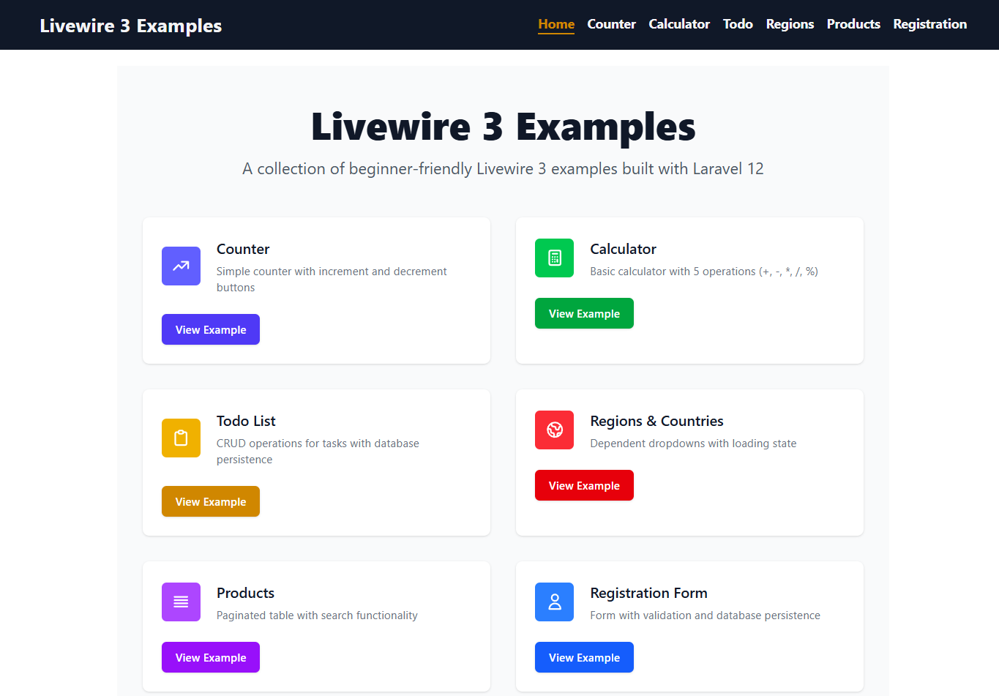
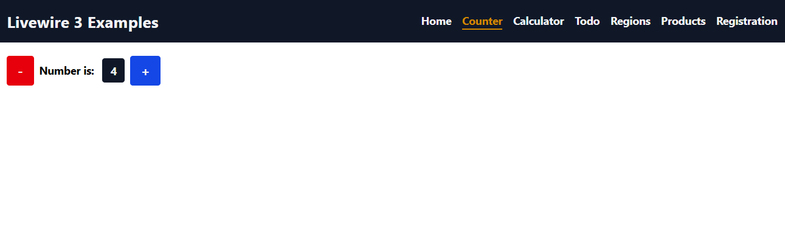
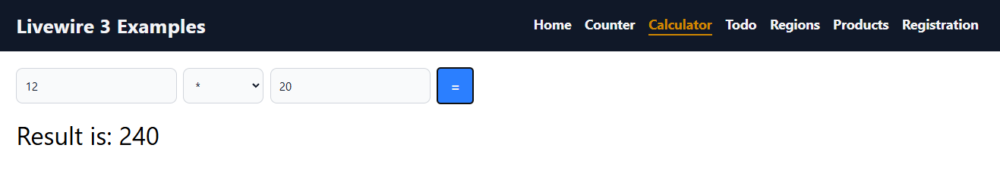
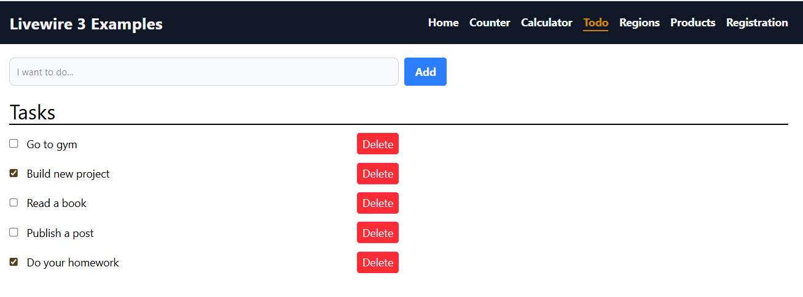
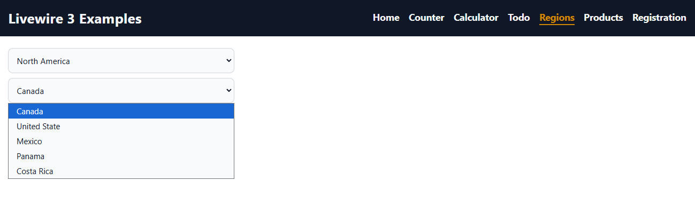
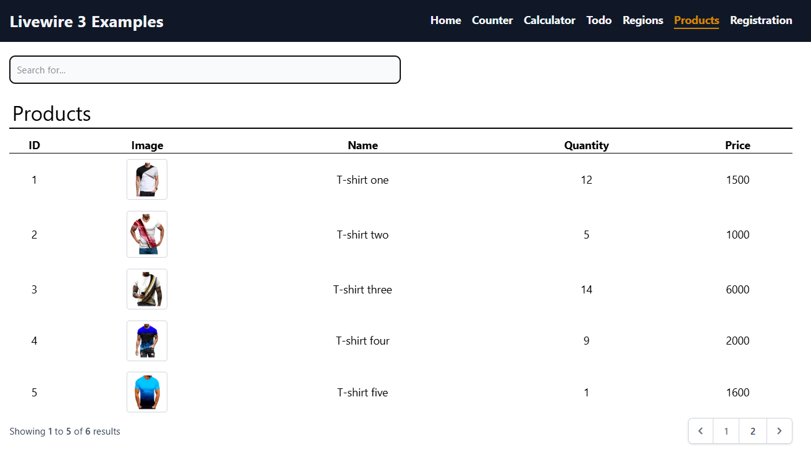
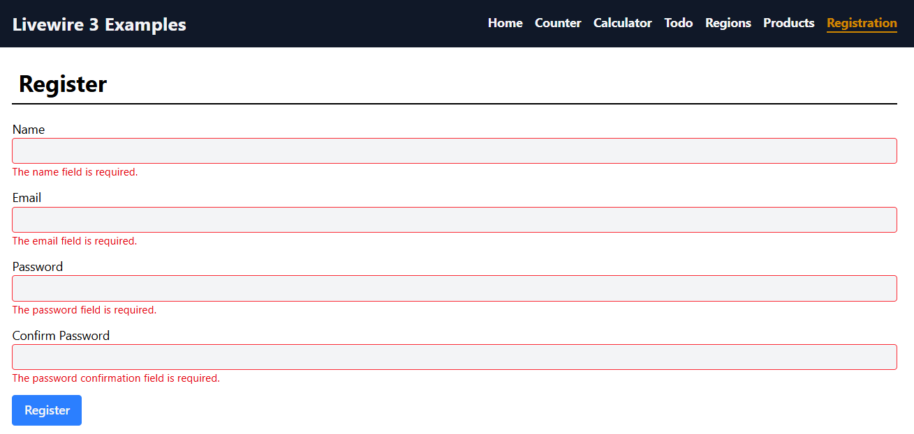

# 🎯 Livewire 3 Examples for Beginners


  
**A collection of practical Livewire 3 examples for Laravel developers**

## ✨ Features
- 6 practical examples from beginner to advanced
- Livewire 3 + Laravel 12
- Tailwind CSS styling
- Ready-to-use with complete setup

## 🚀 Quick Start

### Prerequisites
- PHP 8.2+
- Composer
- Node.js 18+
- Database (MySQL/SQLite)

### Installation
```bash
# Clone repository
git clone https://github.com/Ashkan-GhelichKhani/livewire-3-examples.git
cd livewire-3-examples

# Install dependencies
composer install
npm install
npm run build

# Configuration
cp .env.example .env
php artisan key:generate

# Database setup (SQLite example)
touch database/database.sqlite

# Run migrations
php artisan migrate

# Start development server
php artisan serve
```
### 🧩 Existing examples
| Example | Route | Description |
|---------|-----------|-----------------------|
| Counter | `/counter` | Simple state management |
| Calculator | `/calculator` | Calculation form |
| Todo List | `/todo` | Complete CRUD system |
| Regions | `/regions` | Related dropdowns |
| Products | `/products` | Search + Pagination |
| Registration | `/registration` | Form validation |

### 📸 Screenshots
<div dir="ltr" align="center">
  
  
  
    
  
  
  
</div>

### 📜 License
MIT Licensed. See [LICENSE](LICENSE) file for details.  
Maintained by [Ashkan GhelichKhani](https://ashkanghelichkhani.ir)
